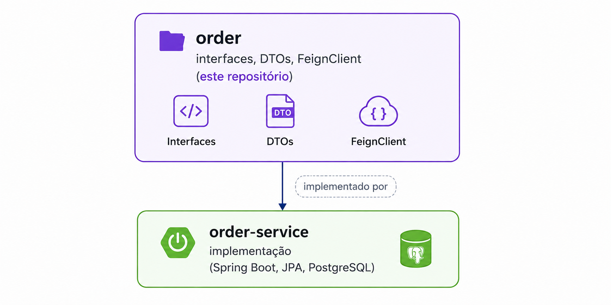

# 📋 Order — Interfaces & Contracts

> Parte do projeto **microservices-26-1** · Plataformas, Microserviços, DevOps e APIs — 2026.1

[](https://openjdk.org/)
[](https://spring.io/projects/spring-boot)
[](LICENSE)

**Responsável:** Ana Beatriz da Cunha

---

## 📌 Sobre

Este repositório contém as **interfaces, DTOs e contratos** da Order API. Ele é importado como dependência pelo [`order-service`](https://github.com/microservices-26-1/order-service), que contém a implementação, e por outros serviços que precisam se comunicar com a Order API.

### Separação de responsabilidades



---

## 🔗 Endpoints Expostos

| Método | Endpoint | Descrição |
|---|---|---|
| `POST` | `/orders` | Criar novo pedido |
| `GET` | `/orders` | Listar pedidos do usuário |
| `GET` | `/orders/{id}` | Detalhar pedido (suporta `?currency=`) |

---

## 📦 Modelos

### OrderRequest
```java
public record OrderRequest(
    List<OrderItemRequest> items
) {}

public record OrderItemRequest(
    String idProduct,
    Integer quantity
) {}
```

### OrderResponse
```java
public record OrderResponse(
    String id,
    LocalDateTime date,
    String currency,
    List<OrderItemResponse> items,
    BigDecimal total
) {}
```

### OrderSummaryResponse
```java
public record OrderSummaryResponse(
    String id,
    LocalDateTime date,
    BigDecimal total
) {}
```

---

## 🔌 FeignClient (para integração entre serviços)

```java
@FeignClient(name = "order", url = "${order.url}")
public interface OrderClient {

    @PostMapping("/orders")
    OrderResponse create(@RequestBody OrderRequest request);

    @GetMapping("/orders")
    List<OrderSummaryResponse> findAll();

    @GetMapping("/orders/{id}")
    OrderResponse findById(
        @PathVariable String id,
        @RequestParam(required = false) String currency
    );
}
```

---

## 📁 Estrutura

```
📁 order/
├── 📁 src/main/java/store/order/
│   ├── 📁 in/           # DTOs de entrada (Request)
│   ├── 📁 out/          # DTOs de saída (Response)
│   └── 📁 client/       # FeignClient interface
└── 📄 pom.xml
```

---

## 🔗 Repositórios Relacionados

| Repositório | Descrição |
|---|---|
| [order-service](https://github.com/microservices-26-1/order-service) | Implementação da Order API |
| [microservices](https://github.com/microservices-26-1/microservices) | Repositório principal |
